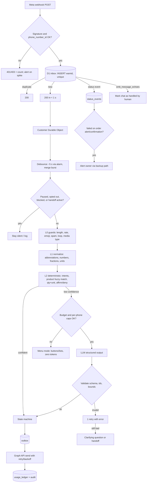
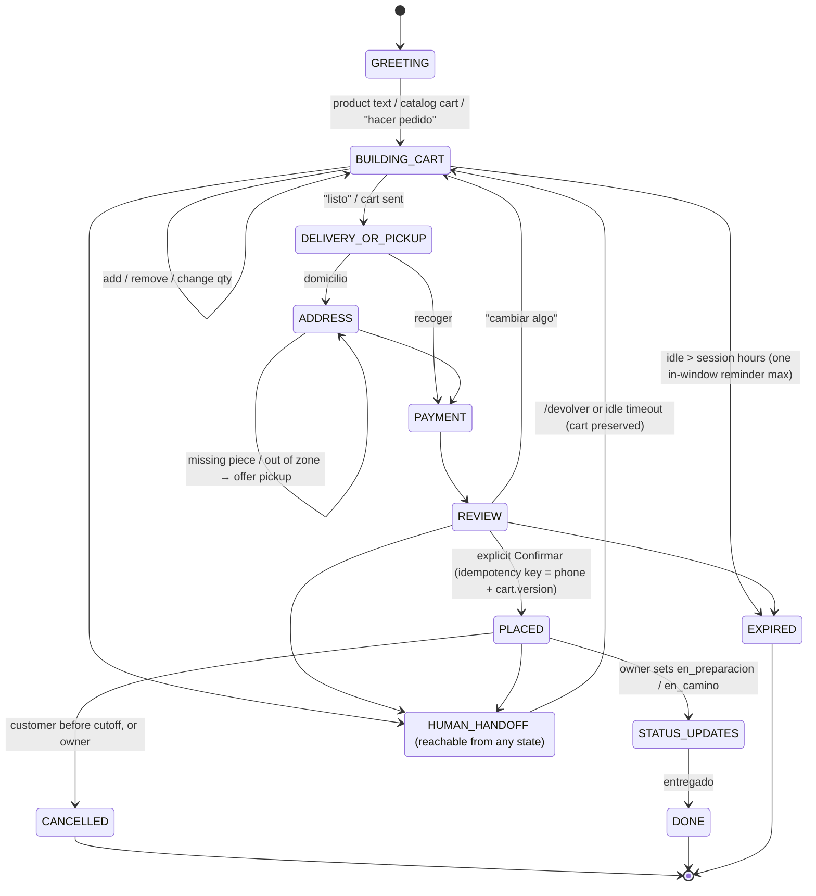
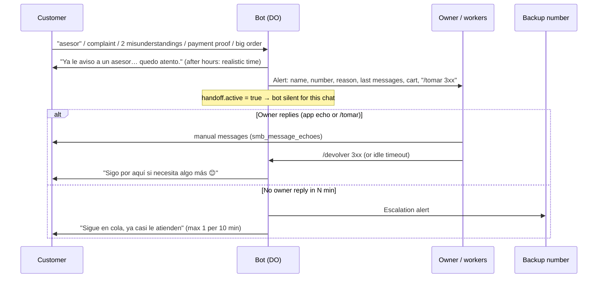
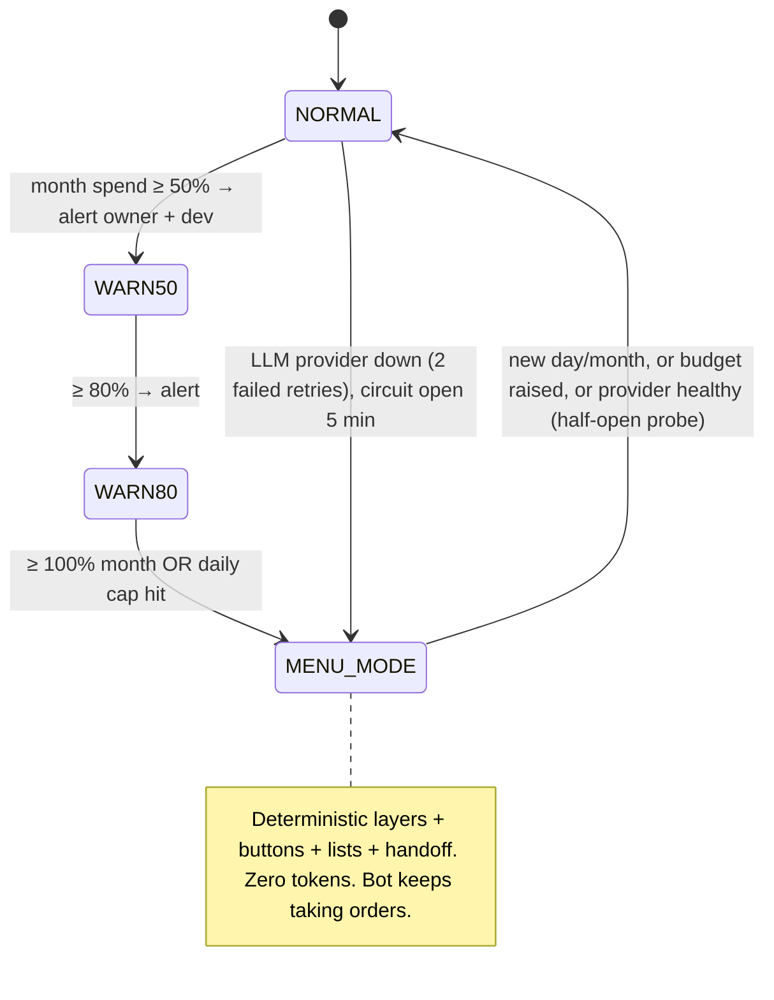

# Conversation and system flows

## 1. Message pipeline (proposed, D2/D3)

## 2. Customer order state machine (§5.7)

Today's `Clientes.paso` maps onto this as: `''` = GREETING/BUILDING_CART, `entrega` = DELIVERY_OR_PICKUP, `direccion`/`direccion?` = ADDRESS, `nombre` = (name capture), `nota`/`confirmar` = REVIEW. PAYMENT, HANDOFF and EXPIRED don't exist yet.

## 3. Human handoff and escalation (§5.8)

## 4. Budget circuit breaker (§7)

